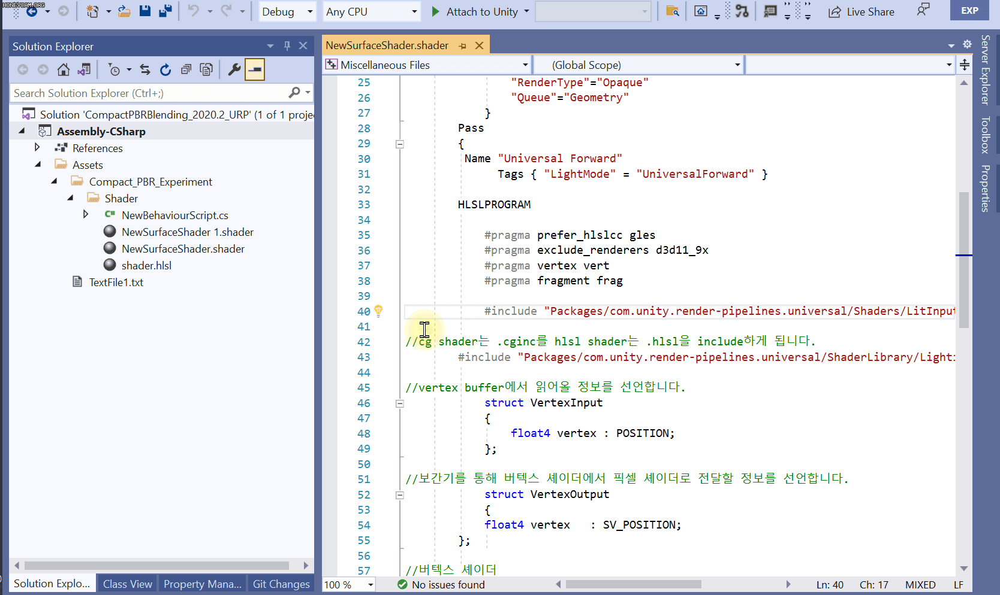

# OpenInclude
Shaderlab, HLSL, CGINCLUDE 파일에서 #include 파일을 바로 열기위한 VS 확장 플러그인  

## OpenInclude.Utility
유틸리티 클래스 라이브러리입니다.   
Path를 찾아줍니다.  

## OpenInclude
VSIX Package 입니다.  
`.shader`, `.hlsl`, `.glsl`, `.cginc` 확장자를 가진 파일에서 작동합니다.  

[BLOG](https://seonghwan.tistory.com/1)  
[MIT LICENSE](../main/LICENSE)  
[DOWNLOAD](../../releases)  
